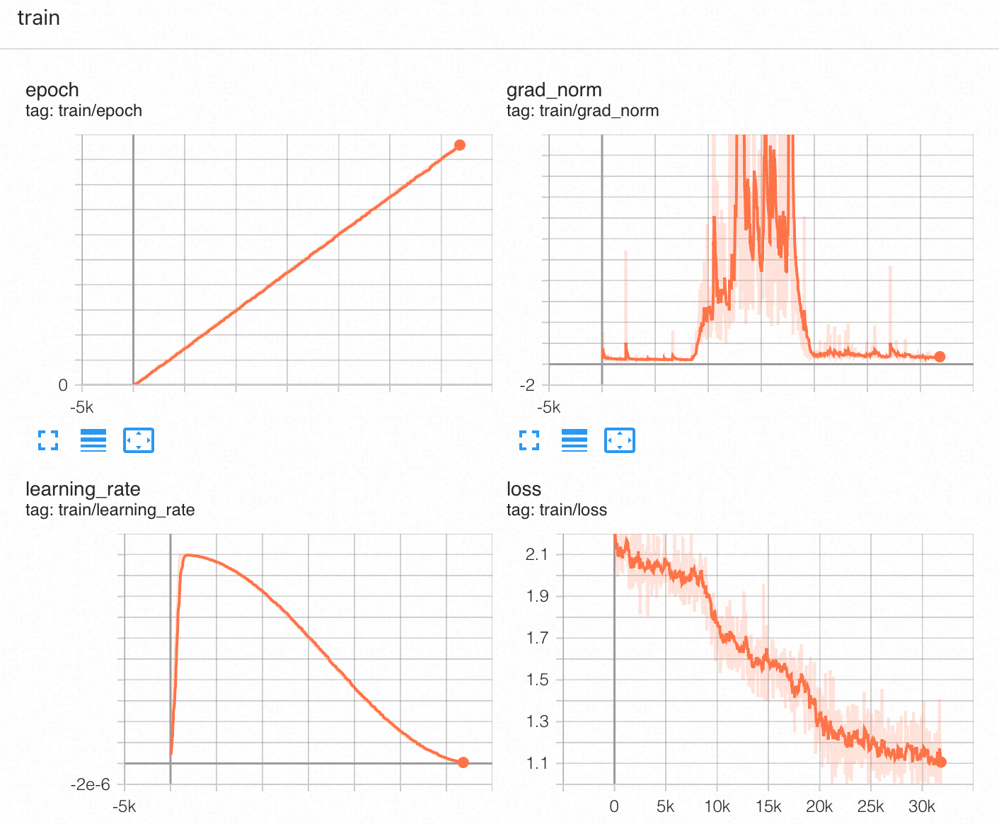
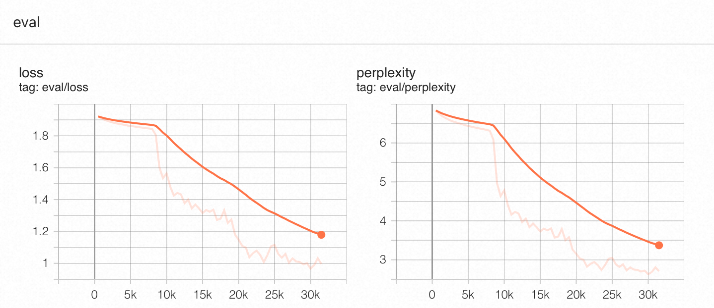
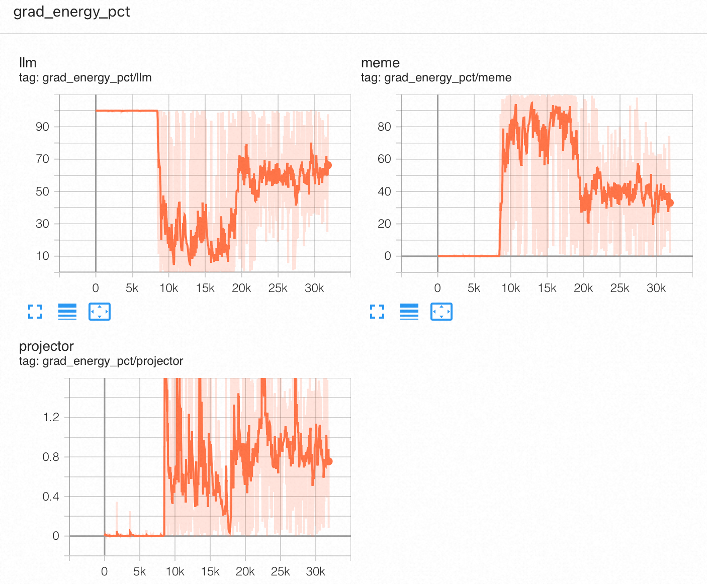
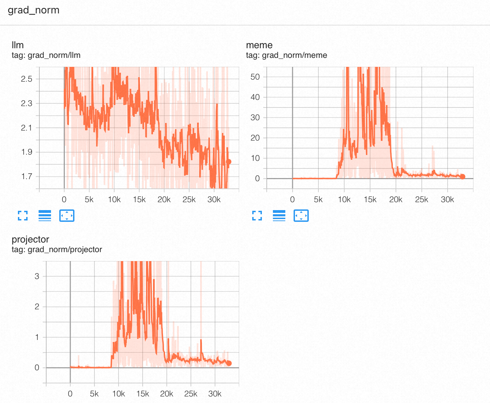
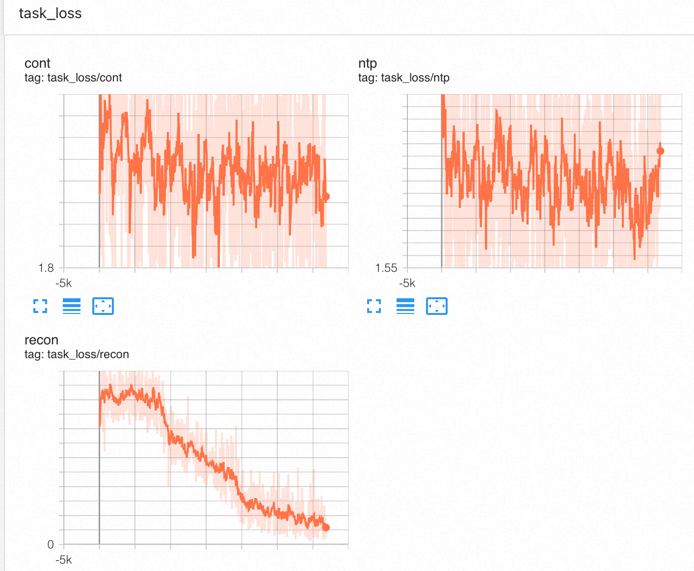
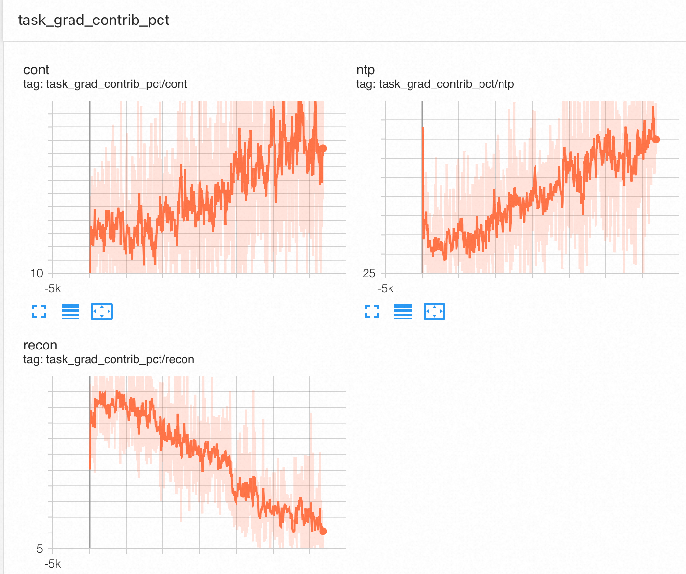

# 训练过程分析 (第一轮预训练)

本文档记录第一轮预训练（~30k 步，约 2 个 epoch）的 TensorBoard 监控指标分析，包括训练过程中观察到的关键现象及其解释。

监控指标定义见 [训练脚本设计 - Step 11](2026-02-18-training_script_design.md#step-11-monitoring-metrics)。

---

## 0. 训练总览 (train)

| 指标 | 初始 | 最终 (~30k) | 趋势 |
|:-----|:-----|:------------|:-----|
| train/loss | ~2.1 | ~1.1 | 持续下降，8k 步后加速 |
| train/grad_norm | ~2.0 | ~1.8 | 8k 步出现尖峰后回落稳定 |
| train/learning_rate | 0 | ~0 | cosine schedule，~5k 步达到峰值后衰减 |
| train/epoch | 0 | ~2 | 线性增长 |

训练 loss 从 2.1 降至 1.1，**在 ~8k 步出现明显的加速拐点**，与下文分析的 MemE 相变时间点吻合。grad_norm 在 ~8k 步出现尖峰，对应相变期梯度的剧烈重新分配。

---

## 1. 验证集指标 (eval)

| 指标 | 初始 | 最终 (~30k) |
|:-----|:-----|:------------|
| eval_loss | ~1.9 | ~1.2 |
| eval_perplexity | ~7.0 | ~3.5 |

验证集 loss 和困惑度在整个训练过程中持续下降，未出现过拟合迹象。PPL 从 7.0 降至 3.5，说明模型的整体文本理解和生成能力在稳步提升。

注意：验证集包含所有三种任务的混合 loss，其中 recon loss 在后期接近 0（见第 4 节），拉低了整体 eval_loss。NTP 和 cont 的验证集表现需要单独拆分才能准确评估。

---

## 2. 梯度能量相变 (grad_energy_pct)

### 观察

训练过程中 `grad_energy_pct` 出现了一次剧烈的自发相变，无任何配置变化：

| 阶段 | 步数 | LLM | MemE | Projector |
|:-----|:-----|:----|:-----|:----------|
| Phase 1 | 0 ~ 6k | ~95% | ~1-2% | ~1.6% → 0% |
| 相变期 | ~6k ~ 8k | 95% → 10% | 2% → 80% | 短暂尖峰 |
| Phase 2 | ~8k ~ 15k | 10-50% | 40-80% | ~0% |
| Phase 3 | ~15k ~ 30k | 30-90%，波动大 | 10-60%，波动大 | ~0% |

### 解释

**Phase 1（LLM 独自学习，0-6k 步）**：MemE 输出的表示接近随机噪声，LLM 学会忽略 memory tokens，仅靠自身自回归能力降低 loss。梯度几乎全部集中在 LLM (95%)。

**相变期（6k-8k 步）**：MemE 的表示质量积累到阈值，LLM 开始利用 memory tokens。Loss 对 MemE 参数突然变得敏感，大量梯度涌入 MemE。这是 encoder-decoder 联合训练中的已知现象。

**Phase 2（MemE 快速学习，8k-15k 步）**：MemE 主导梯度能量 (40-80%)，对应 recon loss 急剧下降期。MemE 在此阶段快速学会编码有效信息。

**Phase 3（动态均衡，15k-30k 步）**：LLM 和 MemE 的梯度能量波动很大（LLM 30-90%, MemE 10-60%），说明训练进入动态博弈状态——当 MemE 编码质量提升时，LLM 需要调整"读取"策略来适配，反之亦然。两个组件交替主导梯度。

**Projector 始终接近 0%**：参数量远小于 MemE (4B) 和 LLM (8B)，绝对 L2 范数自然被淹没。这不代表 Projector 没有学习——per-parameter 梯度可能很大。

---

## 3. 各组件梯度范数 (grad_norm)

| 组件 | 范围 | 趋势 |
|:-----|:-----|:-----|
| LLM | 1.7 ~ 2.5 | 整体缓慢下降，稳定 |
| MemE | 0 → 10-30 | 相变后大幅跳升，稳定在 10-30 |
| Projector | 0 ~ 3 | 初期和相变期各有一次尖峰，之后稳定在 ~0.2-0.8 |

### 分析

- 相变前后 MemE 梯度范数差距达 **三个数量级**（~0.01 → ~10-30），直观反映了相变的剧烈程度。
- Projector 在 ~8k 步的尖峰与相变同步——MemE 突然输出有效表示后，Projector 需要快速调整映射关系。
- LLM 梯度范数未受相变明显影响，保持稳定下降，说明 LLM 的学习过程相对平滑。
- 训练全程无梯度爆炸（无持续上升）或梯度消失（三组件梯度均非零），训练状态健康。

---

## 4. 任务损失趋势 (task_loss)

| 任务 | 初始 | ~8k 步 | ~30k 步 | 趋势 |
|:-----|:-----|:-------|:--------|:-----|
| **Continuation** | ~2.2 | ~2.1 | ~1.8 | 缓慢下降，后期开始有改善 |
| **NTP** | ~1.8 | ~1.7 | ~1.55-1.8 | 缓慢下降后平坦，波动较大 |
| **Reconstruction** | ~2.1 | ~1.5 | **~0** | 急剧下降，30k 步接近 0 |

### 关键发现 1：Reconstruction loss 趋近于 0

这是最显著的发现。Recon loss 从 2.1 持续下降到接近 0，意味着**模型已经基本学会了从 128 个 memory tokens 完美重建原文**。MemE→Projector→LLM 的压缩-解压缩管道高度有效。

下降分为两个阶段：
- **8k 步前**：缓慢下降（2.1 → 1.5），Phase 1 期间 LLM 主导学习，recon 改善有限
- **8k 步后**：急剧下降（1.5 → ~0），与 MemE 相变同步，压缩管道快速建立

### 关键发现 2：Recon/NTP 交叉

约 8k 步时 recon loss 穿越 ntp loss。理论分析：
- **NTP**：模型只看到文本前缀，平均拥有约一半原始 token 的信息
- **Reconstruction**：模型拥有目标文本的完整压缩表示（128 个 memory tokens）

在压缩管道有效时，recon 应低于 ntp（拥有更多信息）。**交叉点标志着 memory tokens 的信息量开始超过自回归上下文**。30k 步时 recon ≈ 0 而 ntp ≈ 1.7，差距极大，说明 128 个 memory tokens 几乎无损地保留了原文信息。

### 关键发现 3：Continuation 终于开始下降

与之前 12k 步分析时的"停滞"结论不同，完整的 30k 步数据显示 **cont loss 在后期（~15k 步后）开始缓慢下降**（从 ~2.1 降至 ~1.8）。这可能与两个因素有关：
1. **Recon 梯度贡献自然衰退**：recon loss 接近 0 后，其梯度贡献从 ~50% 降至 ~5%（见第 5 节），为 cont 腾出了更多梯度空间
2. **MemE 学会了基础编码**：自编码能力成熟后，跨 chunk 的预测性编码开始建立

但 cont 的下降速度仍然远慢于 recon，说明跨 chunk 预测性编码比 chunk 内自编码本质上更难。

### NTP 平坦

NTP loss 在 ~1.55-1.8 之间波动，没有明显下降。NTP 不经过 MemE/Projector 管道，仅依赖 LLM 自身能力。LLM 在 Phase 1 已经学了 6k 步的纯语言建模，后续梯度能量被 MemE 分走，LLM 自身进步变慢。

---

## 5. 任务梯度贡献 (task_grad_contrib_pct)

| 任务 | 初始 | ~15k 步 | ~30k 步 | 趋势 |
|:-----|:-----|:--------|:--------|:-----|
| Continuation | ~10-15% | ~15% | ~15-20% | 缓慢上升 |
| NTP | ~35-40% | ~35% | ~30-40% | 基本稳定 |
| Reconstruction | ~45-50% | ~30% | **~5%** | 持续下降 |

### 分析

Recon 的梯度贡献从 ~50% 急剧下降到 ~5%，这是 recon loss 趋近于 0 的直接结果（`contrib = mean_loss × n_samples`，loss → 0 则 contrib → 0）。

这产生了一个**自然的课程学习效应**：
1. 训练前期：recon 主导梯度 (50%)，MemE 优先学会自编码
2. 训练后期：recon 梯度消退 (5%)，cont 和 ntp 获得更多梯度空间
3. 这解释了为什么 cont loss 在 15k 步后才开始下降——正是 recon 梯度让位后

但 cont 的梯度贡献占比仍然偏低 (~15-20%)，大部分梯度被 NTP 占据 (~30-40%)。如果希望加速 cont 学习，可以考虑为 cont 添加 loss 权重。

---

## 6. 阶段总结

整个 30k 步训练可以划分为三个自然阶段：

| 阶段 | 步数 | 主要事件 | 学习重点 |
|:-----|:-----|:---------|:---------|
| **冷启动** | 0 ~ 6k | LLM 独自学习，MemE 空转 | LLM 基础语言建模 |
| **相变突破** | 6k ~ 15k | MemE 相变，recon 急剧下降 | MemE 自编码能力建立 |
| **能力迁移** | 15k ~ 30k | recon 趋近 0，cont 开始下降 | 跨 chunk 预测性编码开始建立 |

---

## 7. 后续训练建议

### 已验证的成功
- 压缩管道完全打通：128 个 memory tokens 实现近乎无损的文本重建
- 自发相变机制有效：无需人为干预，MemE 自主学通
- 自然课程学习：recon → cont 的梯度迁移自动发生

### 当前瓶颈
- **Continuation 下降缓慢**：30k 步仅从 2.2 降到 1.8，远未达到 recon 的水平
- **NTP 停滞**：LLM 的纯语言建模能力在后期没有明显进步

### 可能的改进方向

| 方向 | 具体措施 | 依据 |
|:-----|:---------|:-----|
| 加强 cont 信号 | 为 cont 任务添加 loss 权重 (如 2x-3x) | cont 梯度贡献仅 ~15-20%，被 ntp 淹没 |
| 冻结 MemE | recon ≈ 0 说明 MemE 编码已成熟，冻结后让 LLM 专注于学习读取和续写 | 类似 Qwen2.5-VL 阶段 2 冻结 ViT |
| 上采样续写数据 | 增加 novels/games（续写可用比例 95%/98%）的采样权重 | 总体仅 12.2% 数据可用于续写 |
| 降低 NTP 权重 | NTP 已基本收敛，可降低其 loss 权重或减少 NTP 样本比例 | NTP loss 已平坦，梯度贡献 ~35% 偏高 |
| 延长训练 | 继续训练观察 cont 是否继续下降 | cont 在 15k-30k 步才开始下降，可能需要更多步数 |
